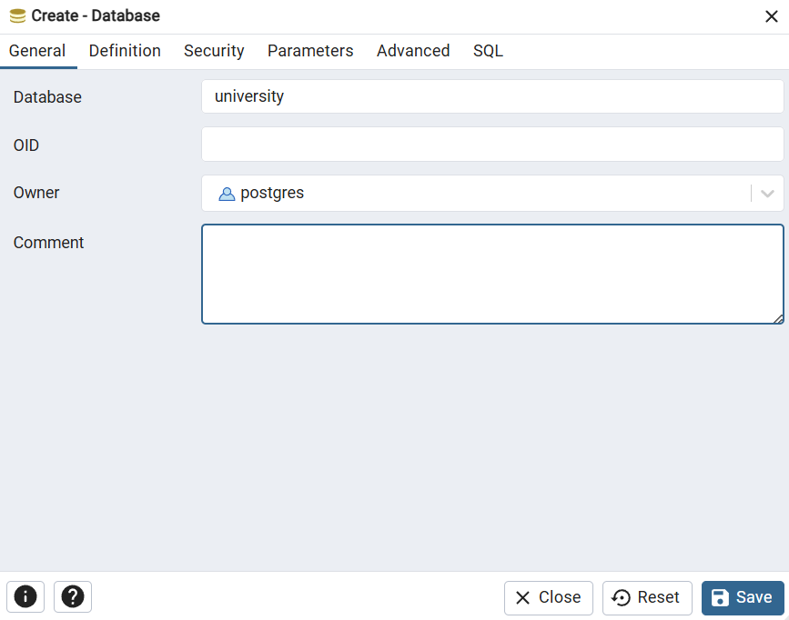
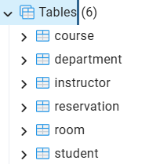
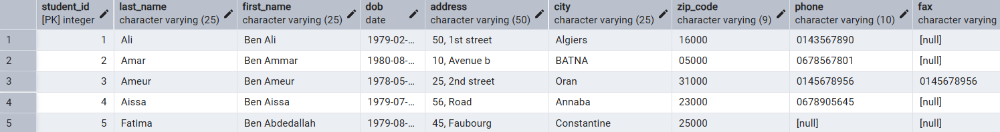
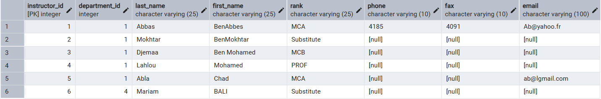
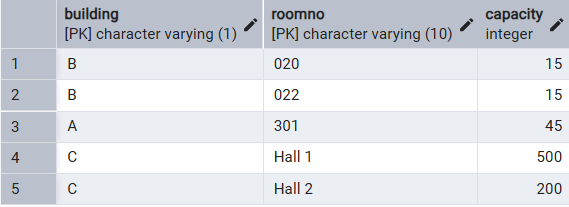

# Lab Report: Database Schema Creation and Management

## Lab Information
**Course:** Introduction to Databases  
**Academic Year:** 2025/2026  
**Date:** November 30, 2025  
**Topic:** Data Definition Language (DDL) - Schema Creation and Evolution

---

## 1. Introduction

### 1.1 Objective
This lab focuses on mastering the Data Definition Language (DDL) in PostgreSQL to create, modify, and manage database schemas. The specific goals include:

- Understanding and implementing DDL commands
- Creating a complete database schema for a university management system
- Performing schema evolution by adding new tables
- Inserting and manipulating data
- Creating views for data abstraction

### 1.2 PostgreSQL Overview
PostgreSQL is an enterprise-grade, open-source object-relational database management system with over 30 years of active development. Key characteristics relevant to this lab include:

- **ACID Compliance**: Ensures data integrity for transactional operations
- **Advanced SQL Support**: Provides comprehensive DDL and DML capabilities including foreign keys, constraints, and triggers
- **Extensibility**: Supports custom data types and user-defined functions
- **MVCC Architecture**: Enables high concurrency without locking issues

---

## 2. Environment Setup

### 2.1 Tools Used
- **pgAdmin**: Graphical user interface for PostgreSQL administration
- **psql**: Command-line interface for direct SQL execution
- **PostgreSQL Server**: Database management system

### 2.2 Workflow Approach
The lab combined both GUI (pgAdmin) and CLI (psql) approaches:
- Database creation and visualization in pgAdmin
- Table creation and data manipulation using SQL scripts
- Verification and testing through SELECT queries

---

## 3. Database Creation

### 3.1 Creating the Database

We began by creating a new database in pgAdmin named `university`:

```sql
CREATE DATABASE university;
```

> **Screenshot:** Database creation in pgAdmin  


The database was successfully created and became the container for all subsequent schema objects.

---

## 4. Schema Design

### 4.1 Tables Created

The following tables were created to model the university system:

* `Department`
* `Student`
* `Instructor`
* `Course`
* `Room`
* `Reservation`

The SQL commands used to create these tables are provided in **Annex I** (lab1.sql file).

> **Screenshot:** Tables successfully created  


### 4.2 Detailed Table Specifications

#### 4.2.1 Department Table
- **Purpose**: Stores academic departments
- **Primary Key**: `Department_id`
- **Unique constraint**: Department name to prevent duplicates
- **Structure**:
  ```sql
  CREATE TABLE Department(
      Department_id integer,
      name varchar(25) NOT NULL,
      CONSTRAINT UN_Department_Name UNIQUE (name),
      CONSTRAINT PK_Department PRIMARY KEY(Department_Id)
  );
  ```

#### 4.2.2 Student Table
- **Purpose**: Contains student personal and contact information
- **Primary Key**: `Student_ID`
- **Features**: Comprehensive contact details with optional fields
- **Structure**: Includes Last_Name, First_Name, DOB, Address, City, Zip_Code, Phone, Fax, Email

#### 4.2.3 Instructor Table
- **Purpose**: Manages faculty information
- **Primary Key**: `Instructor_ID`
- **Foreign Key**: `Department_ID` (links to Department)
- **Business Rule**: Rank constraint limited to 'Substitute', 'MCB', 'MCA', or 'PROF'
- **Referential Integrity**: RESTRICT on UPDATE and DELETE operations

#### 4.2.4 Room Table
- **Purpose**: Tracks classroom facilities
- **Composite Primary Key**: `(Building, RoomNo)`
- **Business Rule**: Capacity > 1 enforced through CHECK constraint
- **Structure**:
  ```sql
  CREATE TABLE Room(
      Building varchar(1),
      RoomNo varchar(10),
      Capacity integer CHECK (Capacity > 1),
      CONSTRAINT PK_Room PRIMARY KEY (Building, RoomNo)
  );
  ```

#### 4.2.5 Course Table
- **Purpose**: Stores course offerings
- **Composite Primary Key**: `(Course_ID, Department_ID)`
- **Foreign Key**: `Department_ID` (links to Department)
- **Features**: Includes detailed course description field

#### 4.2.6 Reservation Table
- **Purpose**: Central table managing room bookings for courses
- **Primary Key**: `Reservation_ID`
- **Multiple Foreign Keys**:
  - Room (Building, RoomNo)
  - Course (Course_ID, Department_ID)
  - Instructor (Instructor_ID)
- **Business Rules Enforced**:
  - `Hours_Number >= 1`
  - `Start_Time < End_Time`
  - Default values for date and time fields

### 4.3 Referential Integrity

The schema implements comprehensive referential integrity through foreign key constraints with `RESTRICT` options on both UPDATE and DELETE operations. This prevents:

- Deletion of departments that have associated instructors or courses
- Deletion of rooms, courses, or instructors that have reservations
- Updates to primary keys that would orphan dependent records

---

## 5. Data Insertion (DML)

### 5.1 Inserting Tuples

After creating the tables, we inserted data into each table using the `INSERT` command. The insertion scripts were taken from **Annex II** (lab1.sql file).

During this step, some syntax and constraint errors were corrected. Clear comments were added to the SQL scripts to improve readability and understanding.

### 5.2 Sample Data Overview

**Departments (4 records)**
- SADS (ID: 1)
- CCS (ID: 2)
- GRC (ID: 3)
- INS (ID: 4)

**Students (5 records)**
- Diverse student population from different Algerian cities: Algiers, Batna, Oran, Annaba, Constantine
- Birth dates ranging from 1978 to 1980
- Mix of complete and incomplete contact information

**Instructors (6 records)**
- Faculty with various ranks (MCA, MCB, PROF, Substitute)
- Distributed across departments (primarily SADS and INS)
- Various levels of contact information completeness

**Rooms (5 records)**
- Buildings: A, B, and C
- Capacities ranging from 15 to 500
- Mix of regular classrooms and large halls

**Courses (4 records)**
- Database-related courses (Databases, Advanced DBs)
- Programming course (C++)
- Language course (English)
- Detailed descriptions for database courses

**Reservations (21 records)**
- Extensive booking history from 2003 and 2006
- Multiple instructors teaching the same courses
- Various time slots (morning: 08:30-11:45, afternoon: 13:45-17:00)
- 3-hour sessions standard

### 5.3 Verifying Data

To verify that the data was inserted correctly across all tables, the following queries were executed:

```sql
SELECT * FROM Department;
```

> **Screenshot:** Output showing department records  


---

```sql
SELECT * FROM Student;
```

> **Screenshot:** Output showing student records  


---

```sql
SELECT * FROM Instructor;
```

> **Screenshot:** Output showing instructor records  


---

```sql
SELECT * FROM Course;
```

> **Screenshot:** Output showing course records  


---

```sql
SELECT * FROM Room;
```

> **Screenshot:** Output showing room records  


---

```sql
SELECT * FROM Reservation;
```

> **Screenshot:** Output showing reservation records  


---

## 6. Database Evolution

### 6.1 Motivation

After establishing the core infrastructure (Students, Instructors, Courses, and Rooms), we identified the need to track:

* **Student enrollments in courses**: To manage which students are registered for which courses
* **Academic performance (grades)**: To record and track student evaluation results

This evolution transforms the database from a simple scheduling system into a **functional Academic Management System** capable of supporting complete academic operations including registration, attendance tracking, and grade management.

### 6.2 Schema Evolution Benefits

The addition of Enrollment and Marks tables provides:
- Complete student lifecycle management (enrollment → attendance → evaluation)
- Historical tracking of academic progress
- Foundation for transcript generation
- Support for academic analytics and reporting

---

## 7. Enrollment Management

### 7.1 Enrollment Table (Inscription)

The `Enrollment` table manages the **Many-to-Many** relationship between **Students** and **Courses**.

**Key Characteristics:**
* One student can enroll in multiple courses
* One course can have multiple students
* The enrollment date is automatically recorded using `DEFAULT CURRENT_DATE`
* Composite primary key prevents duplicate enrollments

```sql
CREATE TABLE Enrollment (
    Student_ID INT,
    Course_ID INT,
    Dept_ID INT,
    Enroll_Date DATE DEFAULT CURRENT_DATE,
    PRIMARY KEY (Student_ID, Course_ID, Dept_ID),
    FOREIGN KEY (Student_ID) REFERENCES Student(Student_ID),
    FOREIGN KEY (Course_ID, Dept_ID) REFERENCES Course(Course_ID, Department_ID)
);
```

**Design Decisions:**
- Composite primary key ensures no duplicate enrollments
- Automatic timestamp captures when enrollment occurred
- Foreign keys maintain referential integrity with Student and Course tables
- Dept_ID included to match Course table's composite key structure

---

## 8. Marks Management

### 8.1 Marks Table (Notes)

The `Marks` table stores student evaluation results with comprehensive tracking capabilities.

**Key Features:**

* Each mark is linked to a valid student and course through foreign keys
* Enforces grading scale **0–20** using a `CHECK` constraint
* Automatically records the date of evaluation
* Allows multiple marks per student per course (supporting retakes, quizzes, exams)
* Uses SERIAL for auto-incrementing primary key

```sql
CREATE TABLE Marks (
    mark_id SERIAL PRIMARY KEY,
    student_id INT NOT NULL,
    course_id INT NOT NULL,
    dept_id INT NOT NULL,
    mark NUMERIC NOT NULL CHECK (mark BETWEEN 0 AND 20),
    mark_date DATE NOT NULL DEFAULT CURRENT_DATE,
    FOREIGN KEY (student_id) REFERENCES Student(student_id),
    FOREIGN KEY (course_id, dept_id) REFERENCES Course(course_id, department_id)
);
```

**Design Decisions:**
- SERIAL data type simplifies mark identification
- CHECK constraint enforces valid grade range (0-20 scale common in French educational system)
- Multiple marks per student-course combination supports various assessment types
- Timestamp tracking enables temporal analysis of academic performance
- NOT NULL constraints ensure data completeness

---

## 9. Views

### 9.1 Concept of Views

A **view** is a virtual table based on the result of a SQL query. It does not store data physically but dynamically displays results when accessed.

**Advantages of Views:**

* **Query Simplification**: Encapsulates complex queries for easier reuse
* **Security Enhancement**: Restricts data access by exposing only necessary columns/rows
* **Data Abstraction**: Hides underlying table structure changes from applications
* **Consistent Interface**: Provides stable query interface even when base tables change

### 9.2 Types of Views

#### Regular Views
- **Dynamic**: Query executes each time the view is accessed
- **Real-time**: Always reflects current state of underlying tables
- **No storage overhead**: Does not consume additional disk space
- **Best for**: Frequently changing data requiring current values

#### Materialized Views
- **Physical**: Query results are stored on disk
- **Performance**: Much faster query response time
- **Refresh required**: Data becomes stale until manually refreshed
- **Best for**: Complex aggregations, reporting, analytics

### 9.3 Reservation Summary View (Regular View)

The following view provides a dynamic count of reservations per instructor.

**Purpose:**
* Aggregate reservation data for workload analysis
* Provide real-time instructor activity monitoring
* Support resource allocation decisions

**Logic:**
* Uses `COUNT(*)` to count all reservations per instructor
* Groups results by `instructor_id`
* Returns instructor ID and their total number of reservations

```sql
CREATE VIEW View_Res AS
SELECT instructor_id, COUNT(*) AS total
FROM Reservation
GROUP BY instructor_id;
```

**Usage Example:**
```sql
SELECT * FROM View_Res ORDER BY total DESC;
-- Shows instructors ranked by number of reservations
```

### 9.4 Materialized Reservation View

For performance-critical scenarios, a materialized version can be created:

```sql
CREATE MATERIALIZED VIEW Mat_View_Res AS
SELECT instructor_id, COUNT(*) AS total
FROM Reservation
GROUP BY instructor_id;
```

**Maintenance:**
```sql
-- Refresh the materialized view to update statistics
REFRESH MATERIALIZED VIEW Mat_View_Res;
```

**When to Use:**
- Dashboard displays requiring frequent access
- Monthly/weekly reports
- Historical analysis where slight data lag is acceptable
- Systems with high query load

---

## 10. Database Operations and Commands

### 10.1 psql Commands Used

Throughout the lab, several psql meta-commands were utilized:

- `\l` - List all databases
- `\c database_name` - Connect to a specific database
- `\dt` - List all tables in current schema
- `\t` - Toggle tuple-only mode (displays raw data without column headers)
- `\d table_name` - Describe table structure

### 10.2 Table Dropping Sequence

When dropping tables, the order must respect foreign key dependencies. Correct sequence:

```sql
DROP TABLE Marks;        -- Depends on Student and Course
DROP TABLE Enrollment;   -- Depends on Student and Course
DROP TABLE Reservation;  -- Depends on Room, Course, Instructor
DROP TABLE Course;       -- Depends on Department
DROP TABLE Instructor;   -- Depends on Department
DROP TABLE Student;      -- Independent
DROP TABLE Room;         -- Independent
DROP TABLE Department;   -- Must be last (referenced by Course and Instructor)
```

**Important Note:** The drop sequence provided in the original lab document would fail due to foreign key violations. Always drop dependent tables before parent tables.

---

## 11. Entity-Relationship Analysis

### 11.1 Relationship Types

**One-to-Many Relationships:**
- Department → Instructor (1:N) - One department has many instructors
- Department → Course (1:N) - One department offers many courses

**Many-to-Many Relationships:**
- Student ↔ Course (through Enrollment) - Students enroll in multiple courses
- Student ↔ Course (through Marks) - Students receive marks in multiple courses

**Complex Relationships:**
- Reservation acts as a junction table linking Room, Course, and Instructor with additional temporal attributes (date, time, duration)

### 11.2 Cardinality Constraints

- Each Course must belong to exactly one Department (mandatory participation)
- Each Instructor must belong to exactly one Department (mandatory participation)
- Each Reservation must reference one Room, one Course, and one Instructor (mandatory participation)
- Students and Courses have optional participation in Enrollment (not all students enrolled, not all courses must have enrollments)

---

## 12. Lessons Learned

### 12.1 DDL Best Practices

1. **Constraint Naming Conventions**
   - Use descriptive prefixes: PK_ (Primary Key), FK_ (Foreign Key), UN_ (Unique), CK_ (Check)
   - Example: `FK_Instructor_Department_ID` clearly indicates purpose
   - Improves maintainability and debugging

2. **Default Values**
   - Reduce application logic complexity
   - Ensure data consistency (e.g., `DEFAULT CURRENT_DATE`)
   - Provide sensible fallbacks for optional fields

3. **Check Constraints**
   - Enforce business rules at database level
   - Prevent invalid data entry (e.g., capacity > 1, mark between 0-20)
   - Centralize validation logic

4. **Composite Keys**
   - Useful when natural business keys span multiple columns
   - Example: (Building, RoomNo) naturally identifies a room
   - Reflects real-world entity identification

### 12.2 Schema Evolution Strategies

- Plan for extensibility from the beginning
- Consider future requirements when designing initial schema
- Use foreign keys to maintain data integrity during schema changes
- Document all schema modifications with comments
- Test constraint violations before production deployment

### 12.3 View Strategy Selection

**Choose Regular Views When:**
- Data changes frequently
- Real-time accuracy is critical
- Query performance is acceptable
- Storage space is limited

**Choose Materialized Views When:**
- Complex aggregations are expensive
- Data changes infrequently
- Query performance is critical
- Scheduled refresh is acceptable

---

## 13. Potential Improvements

### 13.1 Performance Optimization
1. **Add Indexes**: Create indexes on foreign keys and frequently queried columns
   ```sql
   CREATE INDEX idx_reservation_instructor ON Reservation(Instructor_ID);
   CREATE INDEX idx_reservation_date ON Reservation(Reserv_Date);
   ```

2. **Partitioning**: Consider table partitioning for Reservation by date for historical data

### 13.2 Enhanced Data Integrity
1. **Audit Triggers**: Track changes to critical tables
2. **Email Validation**: Add CHECK constraint for email format
3. **Phone Format**: Standardize phone number format

### 13.3 Schema Refinement
1. **Normalization**: Review Reservation table's composite foreign key structure
2. **Cascading Options**: Consider CASCADE for enrollment deletion when course is cancelled
3. **Additional Tables**: Consider adding tables for:
   - Academic terms/semesters
   - Attendance tracking
   - Grade categories (exam, quiz, assignment)

### 13.4 Business Logic Enhancement
1. **Room Capacity Validation**: Ensure enrollment doesn't exceed room capacity
2. **Time Conflict Detection**: Prevent double-booking of rooms
3. **Prerequisites**: Track course prerequisites
4. **GPA Calculation**: Add computed columns or views for grade point averages

---

## 14. Conclusion

This lab successfully demonstrated the complete lifecycle of database schema creation using PostgreSQL's DDL capabilities. The university management system provides a realistic example of relational database design with proper normalization, referential integrity, and business rule enforcement.

### 14.1 Key Achievements

✓ Created a normalized relational database with six core tables  
✓ Implemented comprehensive referential integrity constraints  
✓ Populated database with realistic sample data  
✓ Successfully evolved schema by adding Enrollment and Marks tables  
✓ Created both regular and materialized views for data aggregation  
✓ Verified all operations through systematic testing  

### 14.2 Skills Developed

- Proficiency in PostgreSQL DDL syntax
- Understanding of constraint types and their applications
- Experience with schema evolution techniques
- Knowledge of view creation and appropriate usage scenarios
- Practical experience with both GUI (pgAdmin) and CLI (psql) tools

### 14.3 Practical Applications

The completed database system now supports:
- Course scheduling and room management
- Student enrollment tracking
- Academic performance recording
- Instructor workload analysis
- Foundation for a complete academic management system

The hands-on experience with both pgAdmin and psql tools reinforced understanding of SQL syntax and PostgreSQL-specific features, providing a solid foundation for more advanced database operations, optimization, and administration tasks.

---
