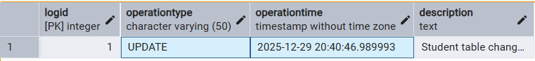

#  Lab 4 : Database Triggers Lab Report 

## Statement-Level Trigger for Student Table Auditing

---

## 1. Introduction

This lab demonstrates the implementation of a **statement-level trigger** in PostgreSQL to audit Data Manipulation Language (DML) operations on the `Student` table. Statement-level triggers fire once per SQL statement, regardless of how many rows are affected, making them efficient for logging bulk operations.

### Objectives
- Create an audit logging table to track changes
- Implement a PL/pgSQL trigger function for statement-level auditing
- Attach a trigger to the Student table that monitors INSERT, UPDATE, and DELETE operations
- Test the trigger with a multi-row UPDATE statement

---

## 2. Implementation

### 2.1 Audit Table Creation

First, we create the `Student_Audit_Log` table to store audit records:

```sql
CREATE TABLE Student_Audit_Log (
    LogID SERIAL PRIMARY KEY,
    OperationType VARCHAR(50) NOT NULL,
    OperationTime TIMESTAMP NOT NULL,
    Description TEXT
);
```

**Table Structure:**
- `LogID`: Auto-incrementing primary key
- `OperationType`: Type of DML operation (INSERT, UPDATE, DELETE)
- `OperationTime`: Timestamp when the operation occurred
- `Description`: Descriptive message about the operation

### 2.2 Trigger Function Implementation

According to the requirements, we create a function named `audit_student_changes_statement()`:

```sql
CREATE OR REPLACE FUNCTION audit_student_changes_statement()
RETURNS TRIGGER 
LANGUAGE plpgsql AS $$
BEGIN
    INSERT INTO Student_Audit_Log (OperationType, OperationTime, Description)
    VALUES (
        TG_OP, 
        CURRENT_TIMESTAMP, 
        'A statement-level DML operation occurred on Students table.'
    );
    
    RETURN NULL; 
END;
$$;
```

**Key Points:**
- `TG_OP`: Special variable that contains the operation type (INSERT/UPDATE/DELETE)
- `CURRENT_TIMESTAMP`: Captures the exact time of the operation
- `RETURN NULL`: Appropriate for AFTER statement-level triggers
- The function is language `plpgsql` (Procedural Language/PostgreSQL)

### 2.3 Trigger Creation

We attach the trigger to the `Student` table:

```sql
CREATE TRIGGER trg_audit_students_statement 
AFTER INSERT OR UPDATE OR DELETE ON Student
FOR EACH STATEMENT 
EXECUTE FUNCTION audit_student_changes_statement();
```

**Trigger Characteristics:**
- **Timing**: AFTER (executes after the DML operation completes)
- **Events**: INSERT, UPDATE, or DELETE operations
- **Level**: FOR EACH STATEMENT (fires once per SQL statement)
- **Action**: Executes the `audit_student_changes_statement()` function

---

## 3. Testing

### 3.1 Test Query

We test the trigger with an UPDATE statement that affects multiple rows:

```sql
UPDATE Student SET City = 'TestCity' WHERE City IS NULL;
```

This statement potentially updates multiple student records where the `City` field is NULL.

### 3.2 Verification Query

```sql
SELECT * FROM Student_Audit_Log;
```

### 3.3 Test Results



**The Expected Behavior:**
- Only **one record** is inserted into `Student_Audit_Log`
- The `OperationType` is 'UPDATE'
- The `OperationTime` reflects when the UPDATE statement executed
- The `Description` contains a message

---

## 4. Analysis

### 4.1 Statement-Level vs Row-Level Triggers

| Aspect | Statement-Level | Row-Level |
|--------|----------------|-----------|
| Firing frequency | Once per SQL statement | Once per affected row |
| Performance | Better for bulk operations | Can be slower with many rows |
| Access to data | Limited (no OLD/NEW values) | Full access to OLD/NEW values |
| Use case | General auditing, logging | Detailed row-level validation |

### 4.2 Advantages of This Implementation

1. **Efficiency**: Only one audit record per statement, regardless of rows affected
2. **Simplicity**: Straightforward logging without row-level complexity
3. **Performance**: Minimal overhead for bulk operations
4. **Completeness**: Captures all three major DML operations (INSERT, UPDATE, DELETE)

### 4.3 Code Corrections from Original

The original implementation had minor discrepancies with requirements:

| Original | Required |
|----------|----------|
| Function: `simple_student_trigger()` | Function: `audit_student_changes_statement()` |
| Description: 'Student table changed' | Description: 'A statement-level DML operation occurred on Students table.' |

---

## 5. Conclusion

This lab successfully demonstrates the creation and implementation of a statement-level trigger in PostgreSQL. The trigger efficiently logs all DML operations on the `Student` table with minimal performance overhead. This approach is particularly useful for:

- Compliance and audit requirements
- Change tracking in production databases
- Monitoring database activity
- Troubleshooting and debugging

The statement-level trigger proves to be an effective solution when detailed row-by-row information is not required, but overall operation tracking is essential.

---

