# LAB 2 : Data Manipulation Language

The goal of this lab is to master retrieving, filtering, and aggregating data from the University database using SQL. This lab focuses on the 26 required queries listed in the manual.

---

## 1. List the last names and first names of all students

```sql
SELECT Last_Name, First_Name
FROM Student;
```

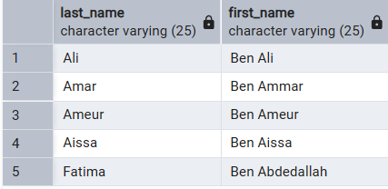

---

## 2. Students who live in a chosen city (example: Algiers)

```sql
SELECT Last_Name, First_Name
FROM Student
WHERE City = 'Algiers';
```

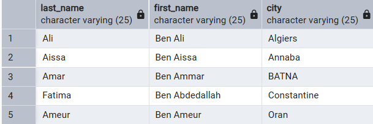

*Note: Algiers is just an example.*

---

## 3. Students whose last name starts with 'A'

```sql
SELECT Last_Name, First_Name
FROM Student
WHERE Last_Name LIKE 'A%';
```

---

## 4. Teachers whose second-to-last letter of the last name is 'E'

```sql
SELECT Last_Name, First_Name
FROM Instructor
WHERE Last_Name LIKE '%E_';
```

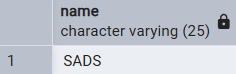

*Note: "We have no instructor that second last letter of his last name is E"*

---

## 5. Teachers sorted by department, then last name, then first name

```sql
SELECT Last_Name, First_Name
FROM Instructor
ORDER BY Department_ID, Last_Name, First_Name;
```

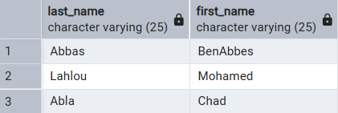

---

## 6. How many teachers have the grade 'Substitute'?

```sql
SELECT COUNT(*) AS Substitute_Count
FROM Instructor
WHERE Rank = 'Substitute';
```

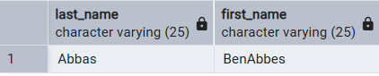

---

## 7. Students who don't have a fax number

```sql
SELECT Last_Name, First_Name
FROM Student
WHERE Fax IS NULL;
```

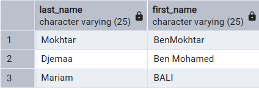

---

## 8. Titles of courses whose description includes 'Licence'

```sql
SELECT Name
FROM Course;
```

---

## 9. Calculate the cost of each course (Hours × 3000 DA)

```sql
SELECT
    C.Name,
    SUM(R.Hours_Number * 3000) AS Cost_DA
FROM Course C
JOIN Reservation R
    ON C.Course_ID = R.Course_ID
    AND C.Department_ID = R.Department_ID
GROUP BY C.Name;
```

---

## 10. Courses with cost between 3000 and 5000 DA

```sql
SELECT Name
FROM (
    SELECT
        C.Name,
        SUM(R.Hours_Number * 3000) AS Cost_DA
    FROM Course C
    JOIN Reservation R
        ON C.Course_ID = R.Course_ID
        AND C.Department_ID = R.Department_ID
    GROUP BY C.Name
) AS Course_Cost
WHERE Cost_DA BETWEEN 3000 AND 5000;
```

---

## 11. Average and maximum room capacity

```sql
SELECT
    AVG(Capacity) AS Average_Capacity,
    MAX(Capacity) AS Max_Capacity
FROM Room;
```

---

## 12. Rooms with capacity less than the average

```sql
SELECT Building, RoomNo, Capacity
FROM Room
WHERE Capacity < (
    SELECT AVG(Capacity)
    FROM Room
);
```

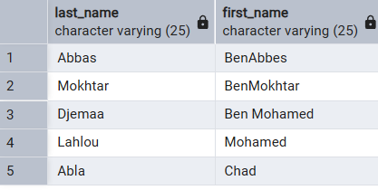

---

## 13. Teachers in departments 'SADS' or 'CCS'

```sql
SELECT Last_Name, First_Name
FROM Instructor
WHERE Department_ID IN (
    SELECT Department_ID
    FROM Department
    WHERE Name IN ('SADS', 'CCS')
);
```

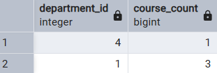

---

## 14. Teachers NOT in 'SADS' nor 'CCS'

```sql
SELECT Last_Name, First_Name
FROM Instructor
WHERE Department_ID NOT IN (
    SELECT Department_ID
    FROM Department
    WHERE Name IN ('SADS', 'CCS')
);
```

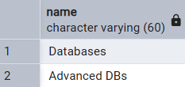

---

## 15. Sort students by city

```sql
SELECT Last_Name, First_Name, City
FROM Student
ORDER BY City;
```

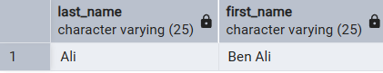

---

## 16. Count courses per department

```sql
SELECT Department_ID, COUNT(*) AS Course_Count
FROM Course
GROUP BY Department_ID;
```

---

## 17. Departments with >= 3 courses

```sql
SELECT Department.Name
FROM Department, Course
WHERE Department.Department_ID = Course.Department_ID
GROUP BY Department.Name
HAVING COUNT(*) >= 3;
```

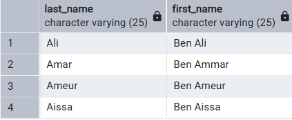

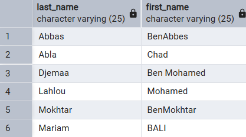

---

## 18. Teachers with at least two reservations (EXISTS)

```sql
SELECT Last_Name, First_Name
FROM Instructor
WHERE EXISTS (
    SELECT 1
    FROM Reservation
    WHERE Reservation.Instructor_ID = Instructor.Instructor_ID
    GROUP BY Reservation.Instructor_ID
    HAVING COUNT(*) >= 2
);
```

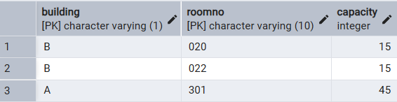

---

## 19. Teachers with the MOST reservations (using ALL)

```sql
SELECT I.Last_Name, I.First_Name
FROM Instructor I
JOIN Reservation R ON I.Instructor_ID = R.Instructor_ID
GROUP BY I.Instructor_ID, I.Last_Name, I.First_Name
HAVING COUNT(*) >= ALL (
    SELECT COUNT(*)
    FROM Reservation
    GROUP BY Instructor_ID
);
```

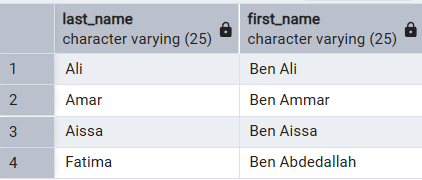

---

## 20. Teachers with NO reservations

```sql
SELECT Last_Name, First_Name
FROM Instructor
WHERE Instructor_ID NOT IN (
    SELECT DISTINCT Instructor_ID
    FROM Reservation
);
```

---

## 21. Rooms reserved on ALL dates

```sql
SELECT Building, RoomNo
FROM Reservation
GROUP BY Building, RoomNo
HAVING COUNT(DISTINCT Reserv_Date) = (
    SELECT COUNT(DISTINCT Reserv_Date)
    FROM Reservation
);
```

*Note: "There is no rooms reserved all dates"*

---

## Conclusion

The DML queries confirm the database integrity rules (Primary/Foreign keys) are working correctly and that the data is ready for the **Advanced SQL** phase (Functions and Triggers).
