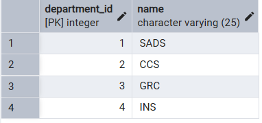
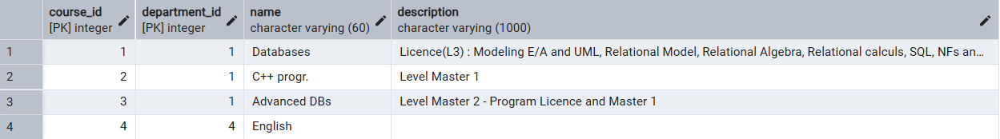
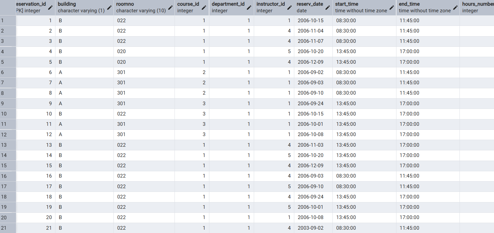

# NSCS Database Project Report

**Students:** Raid Kahlerras (A3), Hassani Fateh (A3)

---

## 1. Project Overview

This project implements a **University Database** using **PostgreSQL**. The objective is to design, create, and evolve a relational database that manages academic entities such as students, departments, instructors, courses, rooms, and reservations.

All SQL code was executed using **pgAdmin Query Tool**. The project covers core database concepts including **DDL**, **DML**, **views**, **functions**, **transactions**, and **triggers**.

---

## 2. Tools & Technologies

* **Database:** PostgreSQL
* **Interface:** pgAdmin 4 (Query Tool)
* **Language:** SQL

---

## 3. Database Creation

### 3.1 Creating the Database

We began by creating a new database in pgAdmin named:

```sql
CREATE DATABASE university;
```

> **Screenshot:** Database creation in pgAdmin


---

## 4. Schema Design

### 4.1 Tables Created

The following tables were created to model the university system:

* `Student`
* `Department`
* `Instructor`
* `Course`
* `Room`
* `Reservation`

The SQL commands used to create these tables are provided in **Annex I**.

> **Screenshot:** Tables successfully created


---

## 5. Data Insertion (DML)

### 5.1 Inserting Tuples

After creating the tables, we inserted data into each table using the `INSERT` command. The insertion scripts were taken from **Annex II**.

During this step, some syntax and constraint errors were corrected. Clear comments were added to the SQL scripts to improve readability and understanding.

### 5.2 Verifying Data

To verify that the data was inserted correctly across all tables, the following queries were executed.

```sql
SELECT * FROM Department;

```

> **Screenshot:** Output showing department records

---

```sql
SELECT * FROM Student;

```

> **Screenshot:** Output showing student records

---

```sql
SELECT * FROM Instructor;

```

> **Screenshot:** Output showing instructor records

---

```sql
SELECT * FROM Course;

```

> **Screenshot:** Output showing course records

---

```sql
SELECT * FROM Room;

```

> **Screenshot:** Output showing room records

---

```sql
SELECT * FROM Reservation;

```

> **Screenshot:** Output showing reservation records

---


## 6. Database Evolution

### 6.1 Motivation

After establishing the core infrastructure (Students, Instructors, Courses, and Rooms), we identified the need to track:

* Student enrollments in courses
* Academic performance (grades)

This evolution transforms the database from a simple scheduling system into a **functional Academic Management System**.

---

## 7. Enrollment Management

### 7.1 Enrollment Table (Inscription)

The `Enrollment` table manages the **Many-to-Many** relationship between **Students** and **Courses**.

* One student can enroll in multiple courses
* One course can have multiple students
* The enrollment date is automatically recorded

```sql
CREATE TABLE Enrollment (
    Student_ID INT,
    Course_ID INT,
    Dept_ID INT,
    Enroll_Date DATE DEFAULT CURRENT_DATE,
    PRIMARY KEY (Student_ID, Course_ID, Dept_ID),
    FOREIGN KEY (Student_ID) REFERENCES Student(Student_ID),
    FOREIGN KEY (Course_ID, Dept_ID) REFERENCES Course(Course_ID, Department_ID)
);
```


## 8. Marks Management

### 8.1 Marks Table (Notes)

The `Marks` table stores student evaluation results.

**Key Features:**

* Each mark is linked to a valid student and course
* Enforces grading scale **0–20** using a `CHECK` constraint
* Automatically records the date of evaluation

```sql
CREATE TABLE Marks (
    mark_id SERIAL PRIMARY KEY,
    student_id INT NOT NULL,
    course_id INT NOT NULL,
    dept_id INT NOT NULL,
    mark NUMERIC NOT NULL CHECK (mark BETWEEN 0 AND 20),
    mark_date DATE NOT NULL DEFAULT CURRENT_DATE,
    FOREIGN KEY (student_id) REFERENCES Student(student_id),
    FOREIGN KEY (course_id, dept_id) REFERENCES Course(course_id, department_id)
);
```

---

## 9. Views

### 9.1 Concept of Views

A **view** is a virtual table based on the result of a SQL query. It does not store data physically but dynamically displays results.

**Advantages of Views:**

* Simplifies complex queries
* Enhances security by restricting data access
* Provides data abstraction

---

### 9.2 Reservation Summary View

The following view provides a dynamic count of reservations per instructor.

**Purpose:**

* Aggregate reservation data without permanent storage

**Logic:**

* Uses `COUNT(*)` since reservations are identified by a combination of instructor, room, and date
* Groups results by `instructor_id`

```sql
CREATE VIEW View_Res AS
SELECT instructor_id, COUNT(*) AS total
FROM Reservation
GROUP BY instructor_id;
```


---

## 10. Conclusion

This project demonstrates the full lifecycle of a relational database system:

* Database creation
* Table design and relationships
* Data insertion and validation
* Schema evolution
* Use of constraints and views

The final result is a structured and extensible **University Academic Management Database** implemented using PostgreSQL.

---

## Annexes

* **Annex I:** Table creation SQL scripts
* **Annex II:** Data insertion SQL scripts

> *Note: Place all referenced screenshots inside an `images/` folder next to this Markdown file.*
